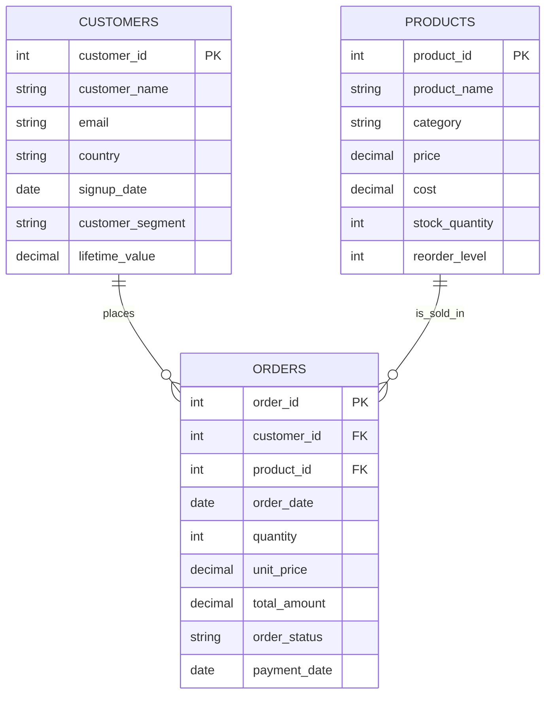
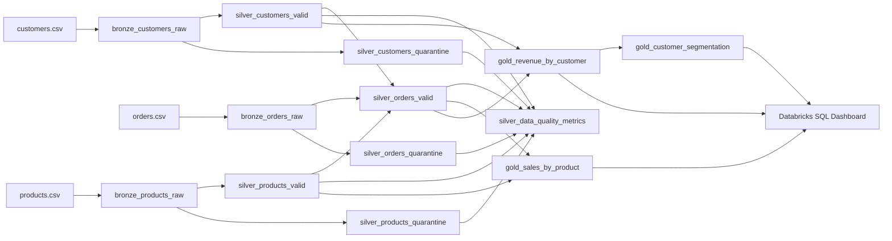

# Data Model

Logical and physical model for the e-commerce Databricks Medallion pipeline. Business columns match the approved source contracts. Technical columns are limited to ingestion lineage, quality status, and publication identity.

---

## 1. Overview

| Layer | Role | Consumer |
| --- | --- | --- |
| Source | Daily CSV files as received | Bronze ingest |
| Bronze | Immutable raw landing + ingest metadata | Silver validation |
| Silver | Typed, validated current data + quarantine + quality metrics | Gold aggregations, DQ reporting |
| Gold | Business-ready aggregations | Databricks SQL Dashboard |

**Keys**

| Entity | Primary key | Foreign keys |
| --- | --- | --- |
| customers | `customer_id` | none |
| products | `product_id` | none |
| orders | `order_id` | `customer_id` → customers, `product_id` → products |

Delta Lake does not physically enforce PK/FK. Silver enforces them logically. Invalid rows are **flagged and quarantined**, never silently deleted.

**Approved volumes:** ~10,000 customers, ~100,000 orders, ~500 products.

---

## 2. Source Data Model

### 2.1 `customers.csv`

| Attribute | Value |
| --- | --- |
| **Purpose** | Customer master from source systems |
| **Grain** | One row per customer (intended). Sample data contains 10 duplicate `customer_id` rows. |
| **PK** | `customer_id` |
| **FK** | none |
| **Cardinality** | 1 customer → 0..N orders |

| Column | Type | Constraint / notes |
| --- | --- | --- |
| `customer_id` | INT | PK; 10 duplicate IDs in sample |
| `customer_name` | STRING | |
| `email` | STRING | 50 NULL emails in sample |
| `country` | STRING | |
| `signup_date` | DATE | |
| `customer_segment` | STRING | Premium / Standard / Basic |
| `lifetime_value` | DECIMAL | Source-supplied value; not used as Gold measure |

### 2.2 `orders.csv`

| Attribute | Value |
| --- | --- |
| **Purpose** | Sales transactions |
| **Grain** | One row per order (intended). Sample data contains 20 duplicate `order_id` rows. |
| **PK** | `order_id` |
| **FK** | `customer_id`, `product_id` |
| **Cardinality** | N orders → 1 customer; N orders → 1 product |

| Column | Type | Constraint / notes |
| --- | --- | --- |
| `order_id` | INT | PK; 20 duplicates in sample |
| `customer_id` | INT | FK to customers; 100 NULL; 50 orphans in sample |
| `order_date` | DATE | |
| `product_id` | INT | FK to products; 200 NULL; 30 orphans in sample |
| `quantity` | INT | |
| `unit_price` | DECIMAL | |
| `total_amount` | DECIMAL | |
| `order_status` | STRING | Pending / Completed / Cancelled |
| `payment_date` | DATE | **Nullable by contract** |

### 2.3 `products.csv`

| Attribute | Value |
| --- | --- |
| **Purpose** | Product catalog |
| **Grain** | One row per product |
| **PK** | `product_id` |
| **FK** | none |
| **Cardinality** | 1 product → 0..N orders |

| Column | Type | Constraint / notes |
| --- | --- | --- |
| `product_id` | INT | PK |
| `product_name` | STRING | |
| `category` | STRING | |
| `price` | DECIMAL | List/catalog price |
| `cost` | DECIMAL | |
| `stock_quantity` | INT | |
| `reorder_level` | INT | |

Source files do not include lineage columns.

---

## 3. Entity Relationships

**Cardinality**

- Customer **1 : 0..N** Orders
- Product **1 : 0..N** Orders
- Order **N : 1** Customer (when FK is valid)
- Order **N : 1** Product (when FK is valid)

Orphan orders (missing or unknown FK) exist in Source/Bronze and Silver quarantine. They do **not** appear in trusted Silver or Gold.

---

## 4. Bronze Data Model

**Purpose:** Preserve source payload exactly as received, plus technical ingest metadata. No business cleansing, no PK enforcement, no FK checks.

**Write mode:** Append-only Delta. Re-ingests of the same file are retained as history.

**Schema strategy:** Business columns keep the **declared source types** where parseable. Unparseable values are retained in `_rescued_data` / `_corrupt_record` rather than dropped. *(Assumption: rescued-data column is technical, not a business field.)*

### Shared Bronze technical columns

| Column | Type | Purpose |
| --- | --- | --- |
| `_batch_id` | STRING | Pipeline run identifier |
| `_ingestion_timestamp` | TIMESTAMP | Ingest time |
| `_source_file` | STRING | Source CSV path/name |
| `_source_file_modification_time` | TIMESTAMP | File timestamp when available |
| `_source_row_identifier` | LONG | 1-based row after header |
| `_rescued_data` | STRING | Malformed / unexpected payload (nullable) |

### 4.1 `bronze_customers_raw`

| | |
| --- | --- |
| **Purpose** | Raw customer landing |
| **Grain** | One row per CSV line ingested |
| **PK/FK** | None enforced |

Payload: same columns and types as Source customers, plus technical columns.

### 4.2 `bronze_orders_raw`

| | |
| --- | --- |
| **Purpose** | Raw order landing |
| **Grain** | One row per CSV line ingested |
| **PK/FK** | None enforced |

Payload: same columns and types as Source orders, plus technical columns.

### 4.3 `bronze_products_raw`

| | |
| --- | --- |
| **Purpose** | Raw product landing |
| **Grain** | One row per CSV line ingested |
| **PK/FK** | None enforced |

Payload: same columns and types as Source products, plus technical columns.

### 4.4 `bronze_ingestion_log`

| | |
| --- | --- |
| **Purpose** | File-level ingest audit |
| **Grain** | One row per source file per `_batch_id` |

| Column | Type |
| --- | --- |
| `_batch_id` | STRING |
| `entity_name` | STRING |
| `_source_file` | STRING |
| `row_count` | LONG |
| `status` | STRING |
| `error_message` | STRING |
| `_ingestion_timestamp` | TIMESTAMP |

**DQ in Bronze:** Structural only (file missing, unreadable, no header). Row defects are preserved, not filtered.

---

## 5. Silver Data Model

**Purpose:** Typed, validated, trusted datasets plus a full quarantine of every failed row. Gold reads **valid tables only**.

**Processing order:** customers → products → orders (order FKs checked against **valid** parents).

**Write mode:** Current valid/quarantine tables are batch-versioned via `_batch_id`. Only a fully successful Silver batch is publishable to Gold.

### Shared Silver quality columns (valid + quarantine)

| Column | Type | Purpose |
| --- | --- | --- |
| `is_valid` | BOOLEAN | `true` only on valid tables |
| `quality_status` | STRING | `VALID` or `QUARANTINED` |
| `quality_rule_codes` | ARRAY&lt;STRING&gt; | All failed rules; empty on valid rows |
| `quality_error_details` | STRING | Human-readable reasons |
| `_validation_timestamp` | TIMESTAMP | When checks ran |
| `_batch_id` | STRING | Same run as Bronze |
| `_source_file` | STRING | Lineage |
| `_source_row_identifier` | LONG | Lineage |

### How invalid data is handled (no silent delete)

| Issue | Handling |
| --- | --- |
| **NULLs** on critical fields | Row quarantined; codes such as `CUSTOMER_EMAIL_NULL`, `ORDER_CUSTOMER_ID_NULL`, `ORDER_PRODUCT_ID_NULL`. `payment_date` NULL is **allowed**. |
| **Duplicate PK** (`customer_id`, `order_id`; also `product_id` if it occurs) | **All** rows sharing that key are quarantined (`DUPLICATE_KEY`). No winner is chosen: no source precedence timestamp was provided. |
| **Invalid FK** | Order quarantined (`FK_CUSTOMER_MISSING`, `FK_PRODUCT_MISSING`). Parents are not invented. FK is checked against **Silver valid** customers/products. |
| **Type / domain failures** | Quarantine (`TYPE_INVALID`, `SEGMENT_INVALID`, `STATUS_INVALID`, etc.). |
| **Valid rows** | Written to `*_valid` with `is_valid = true`, empty rule codes. |

A row may carry **multiple** rule codes. Distinct invalid-row counts must not be computed by summing rule failures.

### 5.1 `silver_customers_valid` / `silver_customers_quarantine`

| | Valid | Quarantine |
| --- | --- | --- |
| **Purpose** | Trusted customer dimension | Failed customer rows with reasons |
| **Grain** | One row per `customer_id` | One failed source row |
| **PK** | `customer_id` (logical unique) | none |

| Column | Type | Valid constraints |
| --- | --- | --- |
| `customer_id` | INT | NOT NULL, unique |
| `customer_name` | STRING | present |
| `email` | STRING | NOT NULL |
| `country` | STRING | |
| `signup_date` | DATE | valid date |
| `customer_segment` | STRING | Premium / Standard / Basic |
| `lifetime_value` | DECIMAL | valid decimal |
| quality + lineage | | as above |

### 5.2 `silver_products_valid` / `silver_products_quarantine`

| | Valid | Quarantine |
| --- | --- | --- |
| **Purpose** | Trusted product dimension | Failed product rows |
| **Grain** | One row per `product_id` | One failed source row |
| **PK** | `product_id` (logical unique) | none |

| Column | Type | Valid constraints |
| --- | --- | --- |
| `product_id` | INT | NOT NULL, unique |
| `product_name` | STRING | present |
| `category` | STRING | |
| `price` | DECIMAL | valid decimal |
| `cost` | DECIMAL | valid decimal |
| `stock_quantity` | INT | valid int |
| `reorder_level` | INT | valid int |
| quality + lineage | | |

### 5.3 `silver_orders_valid` / `silver_orders_quarantine`

| | Valid | Quarantine |
| --- | --- | --- |
| **Purpose** | Trusted fact | Failed order rows |
| **Grain** | One row per `order_id` | One failed source row |
| **PK** | `order_id` (logical unique) | none |
| **FK (valid only)** | `customer_id` → `silver_customers_valid`; `product_id` → `silver_products_valid` | not enforced |

| Column | Type | Valid constraints |
| --- | --- | --- |
| `order_id` | INT | NOT NULL, unique |
| `customer_id` | INT | NOT NULL, exists in valid customers |
| `order_date` | DATE | valid date |
| `product_id` | INT | NOT NULL, exists in valid products |
| `quantity` | INT | valid int |
| `unit_price` | DECIMAL | valid decimal |
| `total_amount` | DECIMAL | valid decimal |
| `order_status` | STRING | Pending / Completed / Cancelled |
| `payment_date` | DATE | nullable; if present, valid date |
| quality + lineage | | |

### 5.4 `silver_data_quality_metrics`

| | |
| --- | --- |
| **Purpose** | Pass rate per rule, per entity, per batch |
| **Grain** | (`_batch_id`, `entity_name`, `rule_code`) |

| Column | Type |
| --- | --- |
| `_batch_id` | STRING |
| `entity_name` | STRING |
| `rule_code` | STRING |
| `rule_category` | STRING |
| `records_evaluated` | LONG |
| `records_passed` | LONG |
| `records_failed` | LONG |
| `pass_percentage` | DOUBLE |
| `_validation_timestamp` | TIMESTAMP |

`pass_percentage = records_passed / records_evaluated × 100`.

Also persist an **overall validity** metric per entity (distinct valid vs invalid rows). Do not sum overlapping rule failures.

---

## 6. Gold Data Model

Gold reads **only** `silver_*_valid` tables (plus Gold-to-Gold for segmentation). Quarantine is excluded.

**Assumption (revenue population):** Gold revenue measures include `order_status = 'Completed'` only. Pending and Cancelled are excluded. Marked as assumption because the requirements do not define status-to-revenue mapping.

**Assumption (zero-order customers):** `gold_revenue_by_customer` includes all valid customers via left join; customers with no qualifying orders have zero measures.

Technical publication columns on all Gold tables: `_batch_id` STRING, `_published_timestamp` TIMESTAMP.

### 6.1 `gold_sales_by_product`

| | |
| --- | --- |
| **Purpose** | Product sales performance for dashboards (e.g. top 10 products by revenue) |
| **Grain** | One row per `product_id` |
| **Source tables** | `silver_orders_valid`, `silver_products_valid` |
| **Join keys** | `orders.product_id = products.product_id` |
| **Join type** | Inner (valid orders to valid products; FK already guaranteed) |

**Dimensions:** `product_id`, `product_name`, `category`  
**Measures:** `total_orders`, `total_revenue`, `avg_order_value`

| Column | Type | Definition |
| --- | --- | --- |
| `product_id` | INT | PK |
| `product_name` | STRING | from products |
| `category` | STRING | from products |
| `total_orders` | LONG | count distinct qualifying `order_id` |
| `total_revenue` | DECIMAL | sum qualifying `total_amount` |
| `avg_order_value` | DECIMAL | `total_revenue / total_orders` (null if zero orders) |

Products with no qualifying orders may appear with zero measures if a left join from products is used. *(Assumption: include all valid products for catalog completeness.)*

### 6.2 `gold_revenue_by_customer`

| | |
| --- | --- |
| **Purpose** | Customer revenue for distribution charts and segmentation input |
| **Grain** | One row per `customer_id` |
| **Source tables** | `silver_customers_valid`, `silver_orders_valid` |
| **Join keys** | `orders.customer_id = customers.customer_id` |
| **Join type** | Left from customers to qualifying orders |

**Dimensions:** `customer_id`, `customer_name`, `customer_segment`  
**Measures:** `total_orders`, `total_revenue`, `avg_order_value`, `lifetime_value_actual`

| Column | Type | Definition |
| --- | --- | --- |
| `customer_id` | INT | PK |
| `customer_name` | STRING | from customers |
| `customer_segment` | STRING | Premium / Standard / Basic |
| `total_orders` | LONG | count distinct qualifying `order_id` |
| `total_revenue` | DECIMAL | sum qualifying `total_amount` |
| `avg_order_value` | DECIMAL | `total_revenue / total_orders` (null if zero orders) |
| `lifetime_value_actual` | DECIMAL | same as `total_revenue` from trusted qualifying orders — **not** source `lifetime_value` |

### 6.3 `gold_customer_segmentation`

| | |
| --- | --- |
| **Purpose** | Segment mix for pie chart (Premium / Standard / Basic) |
| **Grain** | One row per `segment_type` |
| **Source tables** | `gold_revenue_by_customer` |
| **Join keys** | none (group by `customer_segment`) |
| **Join type** | n/a |

**Dimensions:** `segment_type`  
**Measures:** `customer_count`, `avg_revenue`, `total_revenue`

| Column | Type | Definition |
| --- | --- | --- |
| `segment_type` | STRING | PK; maps 1:1 to `customer_segment` |
| `customer_count` | LONG | count of customers in segment |
| `total_revenue` | DECIMAL | sum of `total_revenue` |
| `avg_revenue` | DECIMAL | `total_revenue / customer_count` |

No new segment model is introduced.

---

## 7. Data Quality & Constraints

### Critical completeness (flag, do not drop)

| Entity | Critical non-null (except as noted) |
| --- | --- |
| customers | `customer_id`, `email` (50 NULL emails in sample) |
| products | `product_id` |
| orders | `order_id`, `customer_id` (100 NULL), `product_id` (200 NULL) |
| orders | `payment_date` **may be NULL** |

### Uniqueness

- `customer_id` unique in `silver_customers_valid` (sample: 10 duplicate IDs → all those rows quarantined).
- `order_id` unique in `silver_orders_valid` (sample: 20 duplicate IDs → all those rows quarantined).
- `product_id` unique in `silver_products_valid` (declared PK; flag if duplicates appear).

### Referential integrity

Checked only on typed orders against **valid** parents:

- 50 sample orders with non-existent `customer_id` → quarantine
- 30 sample orders with non-existent `product_id` → quarantine

### Domain

- `customer_segment` ∈ {Premium, Standard, Basic}
- `order_status` ∈ {Pending, Completed, Cancelled}

### Metrics visibility

Every rule writes `pass_percentage` to `silver_data_quality_metrics`. Dashboard quality panels may read this table; revenue dashboards read Gold only.

### What is not a physical constraint

Delta tables do not reject writes that violate PK/FK. Constraints above are **logical** and implemented as Silver quality rules.

---

## 8. Data Lineage

**Lineage keys:** `_batch_id`, `_source_file`, `_source_row_identifier` from Bronze through Silver. Gold carries `_batch_id` of the published Silver snapshot.

**Reconciliation identity**

`Bronze row count (entity, batch) = Silver valid count + Silver quarantine count` for that entity and batch.

---

## 9. Design Decisions

| Decision | Rationale |
| --- | --- |
| Bronze is append-only raw + metadata | Replay and audit; matches “preserve raw source data” |
| Separate valid vs quarantine tables | Prevents accidental use of bad rows in Gold |
| Duplicate PK → quarantine **all** matching rows | No approved survivor rule or update timestamp |
| Order FKs validated against Silver valid parents | Trusted relationships only |
| `lifetime_value_actual` from orders, not source `lifetime_value` | Source LTV is not a validated measure |
| Gold from valid Silver only | Invalid records must not distort dashboard KPIs |
| Segmentation grouped from `gold_revenue_by_customer` | Single definition of customer revenue |

---

## 10. Assumptions

The following are **not** stated as hard requirements; they are required to close the model:

1. Files are a **daily delivery**; whether each file is a full snapshot or an increment is unspecified. Silver current tables are modeled as the **latest successful batch’s** valid/quarantine sets until that is confirmed.
2. **Completed** orders count toward Gold revenue; Pending and Cancelled do not.
3. Valid customers with no qualifying orders appear in `gold_revenue_by_customer` with zeros.
4. Valid products with no qualifying orders may appear in `gold_sales_by_product` with zeros.
5. `lifetime_value_actual` = sum of qualifying `total_amount` (same as `total_revenue` at customer grain).
6. `segment_type` is the existing `customer_segment` domain; no derived RFM segments.
7. `payment_date` NULL is valid; all other listed critical NULLs fail completeness.
8. No email-format regex was approved; completeness is NULL-check on `email` only.
9. Equality of `total_amount` vs `quantity × unit_price` is **not** a reject rule (discounts/tax/shipping unspecified).
10. Numeric “reasonableness” bounds beyond type validity (e.g. negative price) were not approved as reject rules in the source contract; if applied, they must be documented as additional assumptions.
11. Currency, timezone, and catalog/schema names (`ecommerce.bronze` etc.) are unspecified.
12. Quality **job-fail thresholds** (e.g. 99% completeness) are operational policy, not table constraints.
13. Technical columns (`_batch_id`, quality flags, rescued data) are platform metadata, not source business attributes.

---

**Consistency check:** Source → Bronze (same payload) → Silver (typed valid + quarantine) → Gold (three approved aggregations from valid Silver only).
